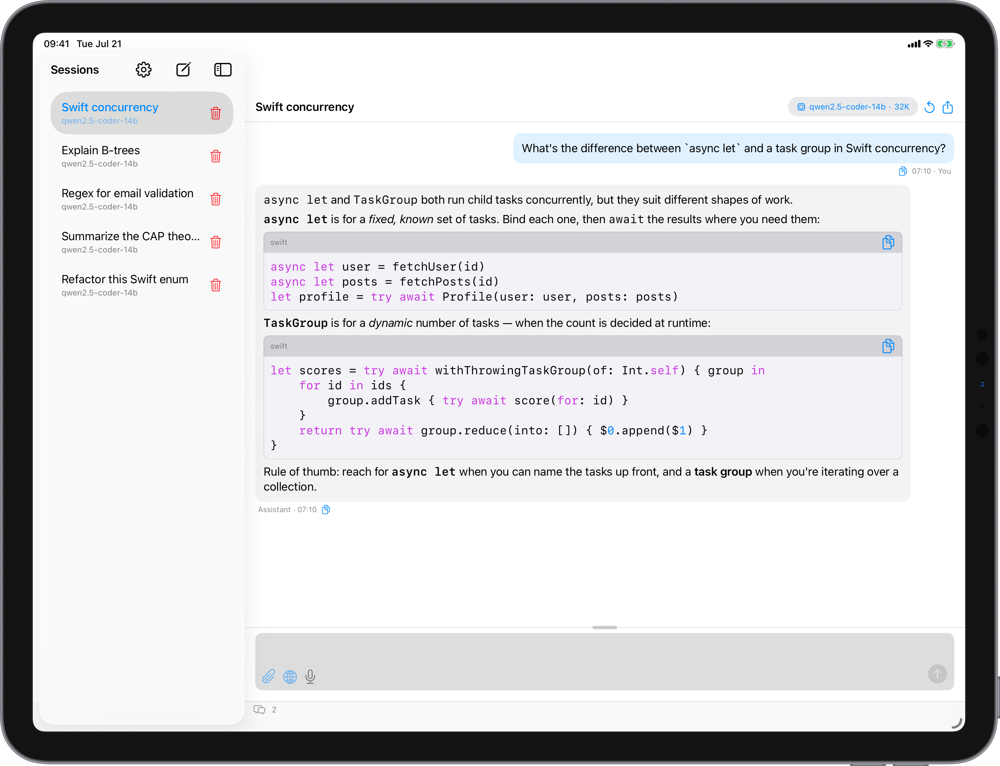
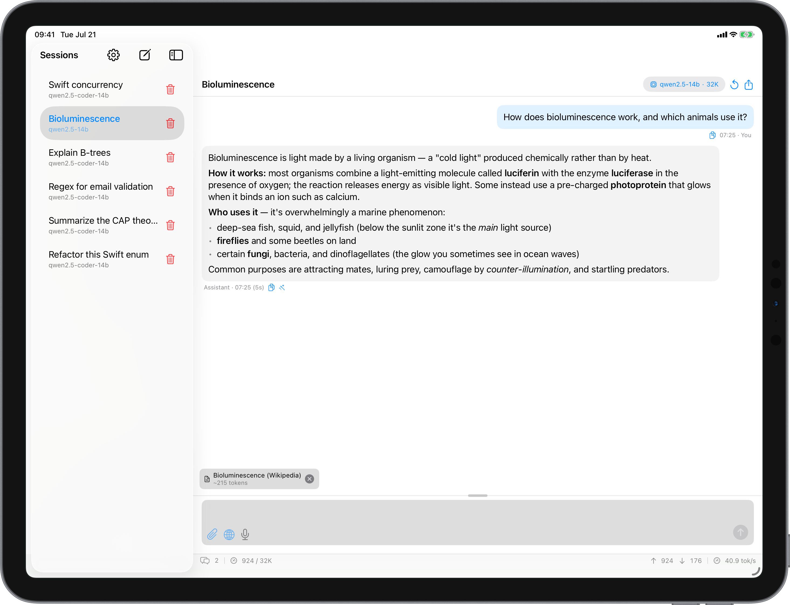

<p align="center">
  
</p>

# Llamatron

A native **macOS and iPadOS** chat client and AI testbed for local and self-hosted large
language models. Llamatron talks to [Ollama](https://ollama.com), a llama.cpp server, and
Apple's on-device Foundation Models — and can generate images through Easy Diffusion or
ComfyUI — so you can run, compare, and **inspect** models from one SwiftUI app.

> Built with SwiftUI, SwiftData, and Swift 6 strict concurrency, on top of the
> [LlamaEngine](https://github.com/mcherry/LlamaEngine) package. Universal app for
> macOS 15+ and iPadOS 18+, built against the macOS 26 / iOS 26 SDK.

<p align="center">
  
</p>

<p align="center">
  
</p>

## Features

**Backends** — chosen per session; the UI adapts to each backend's capabilities:
- **Ollama** — streaming chat, thinking/reasoning models, generation parameters, model
  management, and context-window right-sizing.
- **llama.cpp** (`llama-server`, OpenAI-compatible) — one model at a launch-fixed context
  window, auto-detected on connect.
- **Apple Foundation Models** — fully on-device, no server, on Apple-Intelligence-capable
  hardware (macOS 26 / iPadOS 26).
- **Image generation** — Easy Diffusion or ComfyUI, with importable workflow templates.

**Chat**
- Multiple saved sessions in a sidebar; auto-saved and restored via SwiftData.
- Real-time streaming with autoscroll, a live elapsed-time indicator, and per-turn
  timestamps and generation speed.
- Markdown with syntax-highlighted code (many languages, plus a generic fallback for
  obscure ones), tables, and ` ```mermaid ` diagrams rendered locally in a sandboxed,
  network-isolated web view. Fully selectable text and per-turn copy.
- Auto-generated session titles (each session names itself using its own model).
- A resizable composer — **Return** sends, **Shift+Return** inserts a newline.

**Document context (on-device RAG)**
- Attach text files (picker or drag-and-drop) **or whole folders**, which are walked,
  filtered (skipping dependency/build directories and binaries), and indexed.
- Embeddings run **entirely on-device** (Apple's NaturalLanguage) — retrieval works with
  any backend, needs no embedding server, and works offline.
- An adaptive strategy chosen by token budget — send in full, retrieve the most relevant
  excerpts (with a lexical prefilter for large sets), summarize, or truncate — with
  background indexing and live progress.

**Web**
- **Web search** from the composer across eight sources — Wikipedia, SearXNG, Marginalia,
  Brave, Tavily, Exa, Linkup, and TinyFish — configured in a curated **provider manager**
  (API keys, live readiness, and signup/docs links).
- **Meta-search** queries several engines at once, de-duplicates by URL, and re-ranks by
  consensus (Reciprocal Rank Fusion), with **Comprehensive / Fast / Resilient** modes. It
  honours each provider's rate limits (respecting `Retry-After`, backing off on quota),
  flags which engines were skipped and why, and tracks monthly per-provider usage.
- Add a fetched web page or pasted text as a retrievable source (robots.txt-respecting).

**Vision & multimodal**
- Attach images and ask about them. A vision-capable model sees them directly, or a
  separate **vision model** describes them for a text-only model to reason over.

**Speech**
- **Text-to-speech** (Apple on-device or a Kokoro server), including narrated replies.
- **Dictation** (speech-to-text) into the composer, plus an always-on **conversation
  mode** for hands-free back-and-forth.

**Per-session configuration**
- Backend, model, and context window (as each backend allows).
- A system prompt with a reusable **prompt library**, plus full-session **presets** you
  can save and set as the default for new chats.
- Generation parameters with a fixed **seed** for reproducibility, a reasoning control
  (Auto / On / Off) for thinking models, and a **conversation-history strategy** — send
  in full, truncate, roll up into a running summary, or retrieve relevant earlier turns —
  so sessions keep working as they outgrow the context window.

**AI-testbed transparency**
- A collapsible **reasoning/thinking** view.
- A per-turn **inspector**: latency and time-to-first-token, token counts, the retrieved
  context chunks with similarity scores, history/vision notes, and the exact request
  payload sent.
- **Session export** to Markdown or JSON.
- A **model manager**: list, pull (with progress), and delete Ollama models, and see
  which are loaded.

## Requirements

- **macOS 15 (Sequoia)+** or **iPadOS 18+**. Apple Foundation Models require
  Apple-Intelligence-capable hardware on macOS 26 / iPadOS 26.
- [Xcode](https://developer.apple.com/xcode/) 26+ and XcodeGen (`brew install xcodegen`).
- A reachable **Ollama** or **llama.cpp** server for those backends (Apple Foundation
  Models need none).

## Getting started

Llamatron builds against the [LlamaEngine](https://github.com/mcherry/LlamaEngine)
package through a **local path** (`../LlamaEngine`), so check out the two repositories
**side by side** in the same parent folder. The engine isn't fetched automatically — if
you only cloned this repo, clone the engine next to it:

```bash
# run from the parent folder that contains your Llamatron checkout
git clone https://github.com/mcherry/LlamaEngine.git
```

```
parent/
├── Llamatron/     ← this repository
└── LlamaEngine/   ← the engine it builds against
```

Then generate the Xcode project and open it:

```bash
cd Llamatron
xcodegen generate          # project.yml → Llamatron.xcodeproj (the .xcodeproj is git-ignored)
open Llamatron.xcodeproj
```

On first launch, a welcome sheet lets you pick a backend and run a connection test before
you start. Change backends, servers, and defaults any time from **Settings** (⌘, on Mac,
the gear button on iPad).

**On iPad:** the app can't run a local server, so point it at Ollama/llama.cpp elsewhere
on your network (e.g. `http://192.168.1.10:11434`) — iOS prompts once to allow
local-network access. Or use Apple Foundation Models for a fully offline setup.

### Command line

```bash
# macOS
xcodegen generate && xcodebuild -scheme Llamatron -destination 'platform=macOS' build
xcodebuild -scheme Llamatron -destination 'platform=macOS' test

# iPad (simulator)
xcodebuild -scheme Llamatron-iOS -destination 'generic/platform=iOS Simulator' build
```

## Architecture

Llamatron is a thin SwiftUI presentation layer; the AI logic lives in the
[LlamaEngine](https://github.com/mcherry/LlamaEngine) Swift package (a headless
`LlamaEngine` core plus a `LlamaEngineStore` SwiftData layer with the persisting
`ConversationController`).

```
Llamatron/
  App/        app entry, ModelContainer, settings keys
  Support/    cross-platform helpers (markdown, clipboard, platform shims)
  Views/      SwiftUI views
  Resources/  bundled Mermaid
LlamatronTests/   app-level integration tests
Scripts/LiveE2E/  optional standalone live end-to-end driver
project.yml       XcodeGen project (macOS + iPadOS targets)
```

- Every backend plugs into the same `ChatStreaming` / `LLMBackend` protocols and a
  capability descriptor (`BackendProfile`), so the UI shows only the controls a backend
  supports rather than branching on backend type.
- Swift 6 strict concurrency: SwiftData `@Model` objects stay on the `@MainActor`; only
  `Sendable` values cross to the networking layer.
- Platform differences are additive `#if os(...)` branches, so the macOS and iPadOS
  targets share one codebase.

## Testing

```bash
xcodebuild -scheme Llamatron -destination 'platform=macOS' test
```

The app's own tests are lightweight integration checks; the bulk of the pure logic —
stream parsing, token budgeting, the context-strategy planner, chunking, vector
similarity, retrieval, history management, request encoding, export, Markdown/Mermaid, and
syntax highlighting — is covered by the LlamaEngine package's hermetic suite (380+ tests,
no network).

## License

Llamatron is released under the [MIT License](LICENSE). © 2026 Mike Cherry.

It bundles [Mermaid](https://github.com/mermaid-js/mermaid) (MIT) for diagram rendering;
see [THIRD_PARTY_LICENSES.md](THIRD_PARTY_LICENSES.md) for details.
